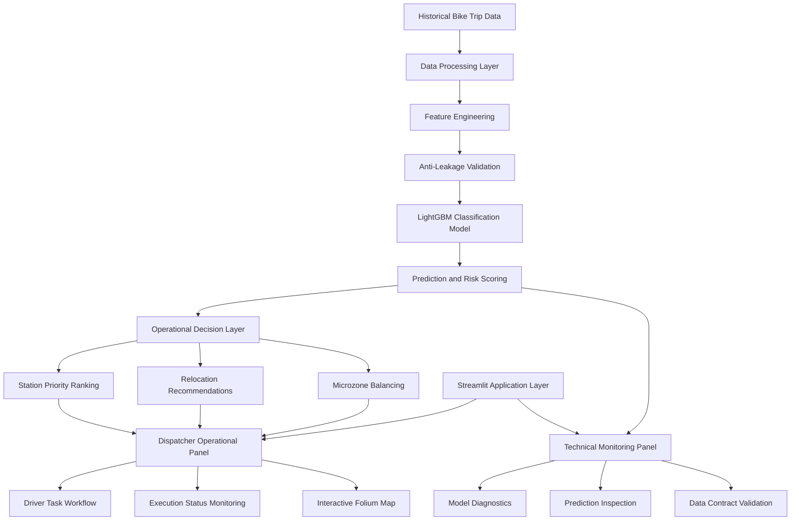

# System Architecture

```mermaid
flowchart TD
    A[Historical Bike Trip Data] --> B[Data Processing Layer]
    B --> C[Feature Engineering]
    C --> D[Anti-Leakage Validation]
    D --> E[LightGBM Classification Model]
    E --> F[Prediction and Risk Scoring]

    F --> G[Operational Decision Layer]
    F --> O[Technical Monitoring Panel]

    G --> H[Station Priority Ranking]
    G --> I[Relocation Recommendations]
    G --> J[Microzone Balancing]

    H --> K[Dispatcher Operational Panel]
    I --> K
    J --> K

    K --> L[Driver Task Workflow]
    K --> M[Execution Status Monitoring]
    K --> N[Interactive Folium Map]

    O --> P[Model Diagnostics]
    O --> Q[Prediction Inspection]
    O --> R[Data Contract Validation]

    S[Streamlit Application Layer] --> K
    S --> O
```
